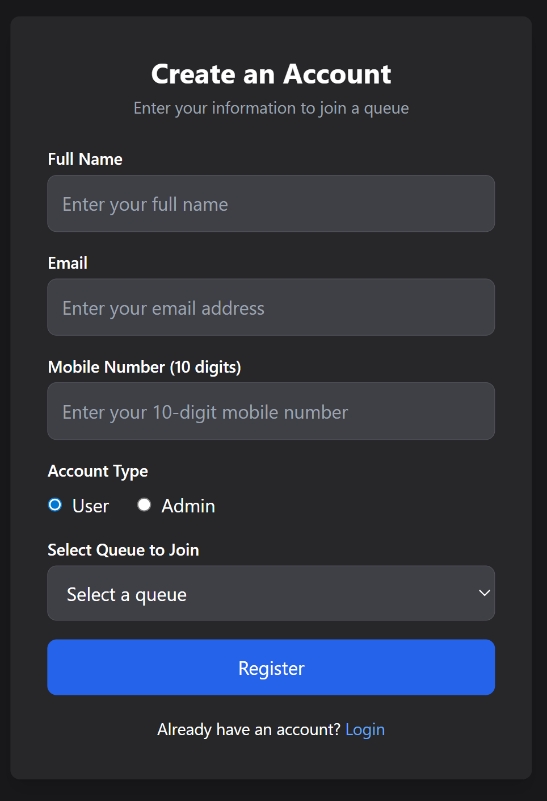
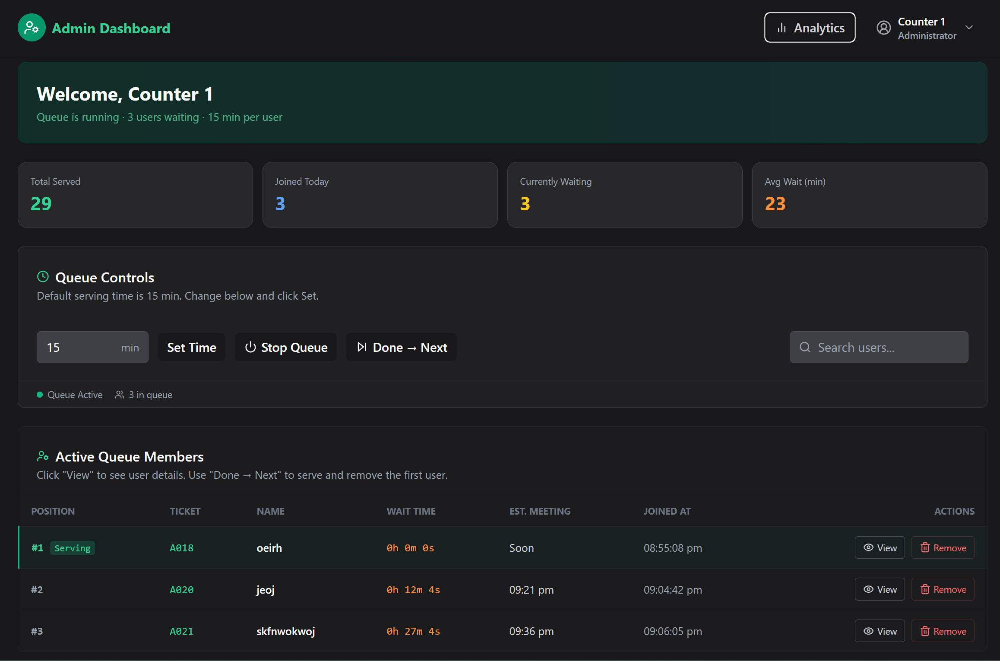
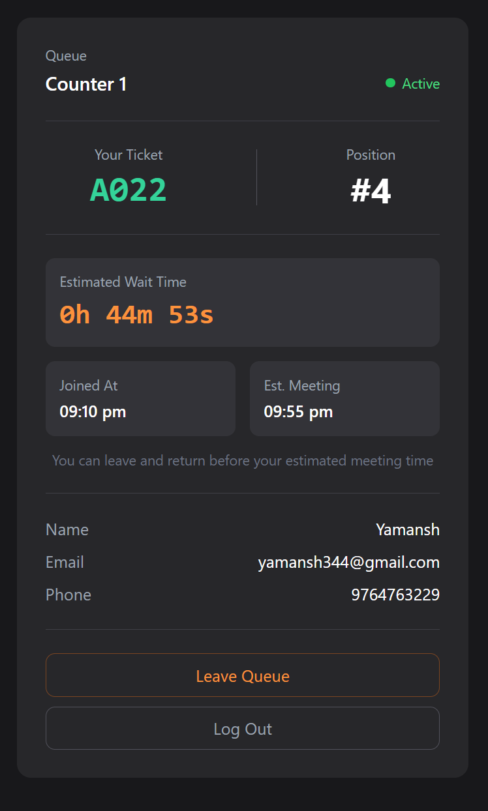

# Virtual Queue Management System

A real-time digital queue solution for hospitals, banks, and service counters. Users scan/register, get a live estimated wait time, and are notified when their turn approaches — eliminating physical waiting.

**[Live Demo](https://virtual-queue-management-system.vercel.app)** · **[Backend API](https://vqms-backend.onrender.com)**

> ⚠️ Free tier hosting — backend may take ~50 seconds to wake up on first request.


## Tech Stack

| Layer | Technology |
|-------|-----------|
| Frontend | React.js, Vite, TailwindCSS |
| Backend | Node.js, Express.js |
| Database | MongoDB, Mongoose |
| Real-time | Socket.io |
| Auth | JWT |
| Notifications | Twilio SMS API |
| Deployment | Vercel (frontend), Render (backend), MongoDB Atlas |

---

## Features

**User**
- Register and join a queue — get unique ticket number (A001, A002...)
- Live countdown timer showing estimated wait time
- Estimated meeting time based on join time + position
- Real-time position updates when others are served or leave
- Notification when position reaches #2 (your turn is next)
- Voluntary leave queue — all timers update automatically
- Queue status visible — Active / Paused / Not Started

**Admin**
- Secure registration with admin secret code
- Start / Stop queue with optional pause reason
- Set serving time per user (default 10 min)
- View user details in read-only modal
- Done → Next: removes current user, recalculates all timers
- Remove users manually (fake/anomalous entries)
- Real-time analytics — total served, avg wait time, users today
- Search users by name, email, or ticket number

---

## System Design (LLD)

### Schema Design

**User** — `fullName` · `email` · `phone` · `ticketNumber` · `position` · `timeRemaining` · `smsSent` · `admin (ObjectId ref)`

**Admin** — `fullName` · `email` · `password (bcrypt)` · `delay` · `queueStatus` · `pauseReason` · `totalServed` · `ticketCounter` · `users (ObjectId[])`

### Timer Logic

| Event | Behaviour |
|-------|-----------|
| Queue start | P1 = 0s, P2 = 1×delay, P3 = 2×delay |
| Cron (every second) | Decrements all timers where `timeRemaining > 0` |
| P1 overtime | P2 hits 0 → all timers freeze until admin pops |
| Done → Next | P1 removed, full recalculate, P2 gets "you're next" notification |
| New user joins | Timer = `lastUser.timeRemaining + delay`, existing timers untouched |
| Admin removes user | Full recalculate from position 1 |

### Socket.io Room Architecture

Each admin queue runs in an isolated Socket.io room `queue_${adminId}` — no global broadcasts.

| Event | Trigger | Recipients |
|-------|---------|-----------|
| `time-updated` | Every second (cron) | All users in queue |
| `queue-updated` | Join / pop / delete | All users in queue |
| `user-nearly-called` | Admin pops P1 | New P2 user only |
| `queue-status-changed` | Start / pause / stop | All users in queue |

### LLD Principles Applied

| Principle | Implementation |
|-----------|---------------|
| Single Responsibility | Controllers handle logic, models handle data, routes handle routing |
| DRY | `recalculateQueue` reused across pop, delete, set-time |
| State Machine | Queue: `notStarted → active → paused` with deliberate transitions |
| Event-driven | Socket.io decouples admin actions from user notifications |
| Atomic operations | `$inc` for ticket counter prevents race conditions |
| Fault tolerance | Server restart auto-resumes active cron jobs from DB state |

### API Endpoints

| Method | Endpoint | Description |
|--------|----------|-------------|
| POST | `/user/register` | Register user, join queue |
| POST | `/user/login` | Login by email |
| GET | `/user/:id` | Get user with admin data |
| DELETE | `/user/:id` | Admin removes user |
| DELETE | `/user/:id/leave` | User leaves voluntarily |
| POST | `/admin/register` | Register admin (requires secret code) |
| POST | `/admin/login` | Admin login |
| GET | `/admin/:adminId` | Dashboard data + user list |
| POST | `/admin/:adminId/pop` | Done→Next (serve current user) |
| GET | `/admin/:adminId/analytics` | Queue statistics |
| DELETE | `/admin/:id` | Delete admin + all users |
| PUT | `/users/set-time/:adminId` | Update serving time |
| POST | `/start-process/:adminId` | Toggle queue start/stop |
---

## Local Setup

```bash
# Clone
git clone https://github.com/Ravi-ranjan1801/Virtual-Queue-Management-System.git
cd Virtual-Queue-Management-System

# Frontend
npm install
echo "VITE_API_URL=http://localhost:5000" > .env
npm run dev

# Backend
cd api
npm install
# create api/.env (see below)
node index.js
```

**`api/.env`**
```
PORT=5000
DB_URL=mongodb://localhost:27017/queue_db
SECRET_KEY=your_jwt_secret
ADMIN_SECRET_CODE=manit2024
NODE_ENV=development
```

---

## Demo Credentials

| Role | Field | Value |
|------|-------|-------|
| Admin | Secret Code | `manit2024` |
| Admin | Email | `demo@vqms.com` |
| Admin | Password | `demo1234` |
| User | — | Register with any email, select a queue |

---

## Git Workflow
main        → production-ready, deployed
development → all feature work, merged to main per phase

Commit convention: `feat:` `fix:` `docs:` `refactor:`

---

---

## Screenshots


| Register & Join Queue | Admin Dashboard | User Queue Status |
| :---: | :---: | :---: |
|  |  |  |


---


**Made with ❤️ by [Raviranjan Kumar](https://github.com/Ravi-ranjan1801)**
